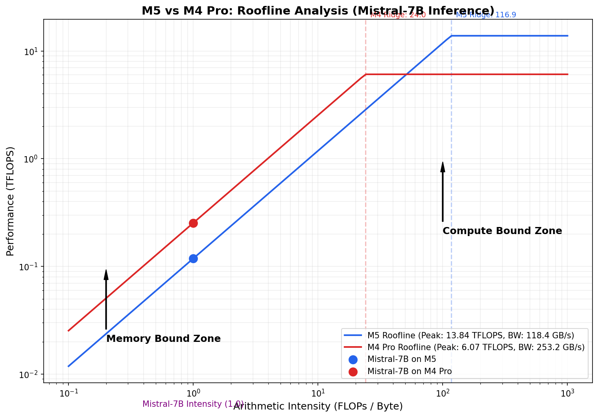

# 📊 M5 vs. M4 Pro: The Architectural Shift Analysis

**Date:** January 22, 2026  
**Subject:** Comparative Benchmarking of Apple M5 (Base) vs. Apple M4 Pro for LLM Workloads

---

## 1. The Core Paradox: Inference vs. Training

Our benchmarks of **Mistral-7B (Float16)** revealed a striking reversal of performance between the two chips depending on the task:

| Task | Winner | Factor | Bottleneck |
| :--- | :--- | :--- | :--- |
| **Fine-tuning (Training)** | **M5** | **2.5x Faster** | Compute-Bound (TFLOPS) |
| **Inference (Generation)** | **M4 Pro** | **2.1x Faster** | Memory-Bound (GB/s) |

---

## 2. Roofline Analysis: Visualizing the Bottlenecks

The **Roofline Model** below explains exactly why this "Inference Flip" occurs. It plots Performance (TFLOPS) against Arithmetic Intensity (FLOPs/Byte).

### Key Insights from the Plot:
*   **The "Slant" (Memory Ceiling):** During **Inference**, we are in the memory-bound zone (Intensity ≈ 1.0). The M4 Pro's roof is 2.1x higher here because its memory bus is wider (253 GB/s vs 118 GB/s).
*   **The "Flat Top" (Compute Ceiling):** During **Training**, we move toward the compute-bound zone. The M5's roof is 2.3x higher (13.8 TFLOPS vs 6.1 TFLOPS) due to its new **Neural Accelerators** integrated into the GPU cores.
*   **The Ridge Point:** 
    *   **M4 Pro:** 24.0 FLOPs/Byte
    *   **M5:** 116.9 FLOPs/Byte (A "Compute Monster" that is almost always starving for data).

---

## 3. Detailed Performance Comparison (Float16)

### Compute (GEMM)
| Matrix Size | M5 (TFLOPS) | M4 Pro (TFLOPS) | Ratio |
| :--- | :--- | :--- | :--- |
| 2048×2048 | **12.62** | 5.64 | 2.2x |
| 4096×4096 | **13.84** | 6.03 | 2.3x |
| 8192×8192 | **12.49** | 6.07 | 2.1x |

### Memory Bandwidth
| Metric | M5 | M4 Pro | Ratio |
| :--- | :--- | :--- | :--- |
| Achieved Read | 118 GB/s | **253 GB/s** | 2.1x |
| Achieved Copy | 119 GB/s | **230 GB/s** | 1.9x |
| Bus Width | 128-bit | **256-bit** | 2.0x |

---

## 4. Architectural Breakdown

### Why M5 Wins Training: "Neural Accelerators"
The M5 introduces a fundamental shift: **Matrix-multiply hardware (Neural Accelerators) integrated directly into every GPU core.**
*   **M4 Pro:** Has more raw GPU cores (standard shaders), but they lack the specialized matrix-math density of the M5.
*   **M5:** Achieves **58.9% MFU** (Model FLOPs Utilization) in training, nearly double the efficiency of the M4 Pro (30.4%).

### Why M4 Pro Wins Inference: "The Fire Hose"
Inference is a "weight-loading" game. Every token generated requires reading the entire model from RAM.
*   **The Bus Advantage:** The M4 Pro utilizes a wider memory bus (likely 256-bit) to achieve 253 GB/s. 
*   **The M5 Bottleneck:** Despite using faster memory chips (9600 MT/s), the M5 is throttled by its 128-bit bus, creating a "Garden Hose" effect that starves its powerful compute engines during inference.

---

## 5. Distributed Strategy for Lemurian Runtime

This asymmetry is a perfect test case for a **Hierarchical Runtime**:

1.  **M5 (The Compute Worker):** Should handle the heavy lifting of backward passes and FFN expert layers in MoE models.
2.  **M4 Pro (The Memory Manager):** Should handle the KV-Cache, Attention mechanisms, and Token Generation where bandwidth is king.

**Conclusion:** The M5 is a "Compute Monster" designed for the AI training era, while the M4 Pro remains the "Inference King" due to its superior data throughput.
