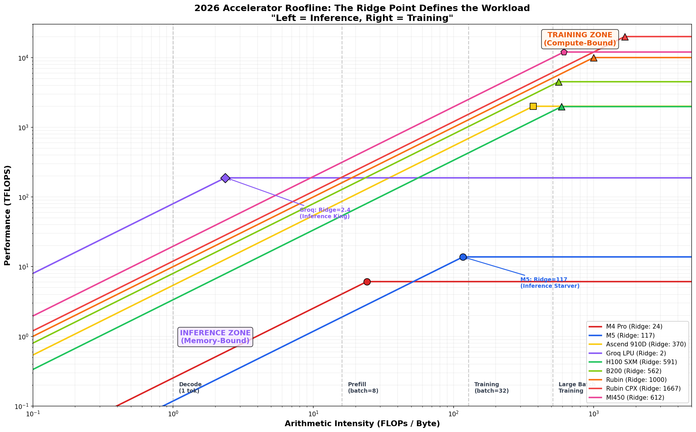

# Silicon ML Benchmarks
This repository is a technical investigation into the evolving architecture for GenAI. It moves beyond "speed tests" to analyze **Arithmetic Intensity**, **Model FLOPs Utilization (MFU)**, and the **Inference Paradox**.

---

## Summary: The "Inference Paradox"

Machines being used: 
*   **M5 (The Compute Monster):** Optimized for **Compute Density**. It introduces integrated **Neural Accelerators** into every GPU core. Result: **2.5x faster training** and fine-tuning than the M4 Pro.
*   **M4 Pro (The Bandwidth Beast):** Optimized for **Data Throughput**. Its wider memory bus achieves 2x higher bandwidth. Result: **2.1x faster inference** (token generation) than the M5.

**The TL;DR:** For training/fine-tuning where math is the bottleneck, the M5 is king. For inference where loading weights is the bottleneck, the M4 Pro remains the king.

---

## 🛠️ Getting Started

### 1. Requirements
*   macOS 15.0+
*   Python 3.9+
*   Thunderbolt 4 cable (for Phase 2 Distributed benchmarks)

### 2. Setup
```bash
git clone https://github.com/taneja-rohit/mac-ml-benchmark.git
cd mac-ml-benchmark
python3 -m venv venv && source venv/bin/activate
pip install -r requirements.txt
```

### 3. Run Benchmarks
```bash
# Results auto-save to results/raw/<CHIP_NAME>/
python3 run_benchmarks.py
```

---

## The "Why": Methodology & Reasoning

### Why Benchmark Layers Separately?
Modern LLM performance is often obscured by framework overhead. We break benchmarks down into:
1.  **Raw GEMM**: To measure peak theoretical compute (TFLOPS).
2.  **Attention Mechanisms**: To measure memory-latency sensitivity.
3.  **Transformer Blocks**: To measure fused-kernel efficiency.
4.  **End-to-End (Mistral-7B)**: To measure real-world application performance.

### The Dance of Bandwidth and Compute Density
Models move from fine-tuning to recall to reasoning, the bottleneck takes a pendulamic shift from **loading weights** to **calculating gradients**. Interestingly, Apple's latest M5 is prioritizing "FLOPs per Watt" over "Bytes per Second."

---

## 💻 Hardware Analysis: M5 vs. M4 Pro

| Feature | Apple M5 (Base) | Apple M4 Pro |
| :--- | :--- | :--- |
| **Primary Strength** | **Compute Density** | **Memory Throughput** |
| **New Tech** | Integrated Neural Accelerators | High-Width Memory Bus |
| **Peak FP16 TFLOPS** | **13.8 TFLOPS** | 6.1 TFLOPS |
| **Peak Bandwidth** | 118 GB/s | **253 GB/s** |
| **Ridge Point** | 116.9 FLOPs/Byte | 24.0 FLOPs/Byte |

### Reasoning:
*   **M5 wins Training** because its GPU cores now contain dedicated matrix-math units (similar to NVIDIA Tensor Cores), allowing it to process backward passes significantly faster.
*   **M4 Pro wins Inference** because token generation is a "weight-reading" game. The M4 Pro's 256-bit bus (approx) moves weights twice as fast as the M5's restricted 128-bit bus.

---

## ⚡ Framework Battle: PyTorch+MPS vs. MLX

We tested both frameworks at the **exact same precision (Float16)** to remove quantization bias.

*   **PyTorch + MPS (The Powerhouse):** Currently achieves **2.3x higher TFLOPS** on M5. Apple's `MPSGraph` is highly optimized for the new M5 Neural Accelerators.
*   **MLX (The Efficient):** Excellent for memory-constrained inference and 4-bit quantization, but currently underperforms in raw FP16 GEMM on M5, suggesting a need for kernel updates for the 2026 hardware.

---

## 📊 Visual Proof: Roofline Analysis (M5 vs M4 Pro)

The **Roofline Model** below proves that Mistral-7B inference is strictly **Memory-Bound**.


*   **Memory Bound Zone:** Both chips are stuck on the "slanted roof." The M4 Pro's roof is higher, thus it runs faster.
*   **Compute Bound Zone:** During training, we hit the "flat top." The M5's top is much higher, thus it trains faster.

---

## 🌍 Industry Roofline: Consumer to Datacenter (Updated Jan 26, 2026)

### Why Ridge Point Matters

The **Ridge Point** is the arithmetic intensity at which a chip transitions from memory-bound to compute-bound:

$$\text{Ridge Point} = \frac{\text{Peak TFLOPS} \times 1000}{\text{Memory BW (GB/s)}}$$

**Chips with lower ridge points are easier to saturate.** A chip with Ridge=2 hits peak performance on simple inference. A chip with Ridge=1000 requires massive batch sizes or operator fusion to avoid idling.

### 2026 Accelerator Landscape



| Chip | Peak FP16 (TFLOPS) | Memory BW (TB/s) | Ridge Point | Classification |
| :--- | :--- | :--- | :--- | :--- |
| **Groq LPU** | 188 | 80.0 (SRAM) | **2.4** | 🟣 **Inference King** |
| **M4 Pro** | 6.1 | 0.253 | **24** | 🔴 Consumer Inference |
| **M5** | 13.8 | 0.118 | **117** | 🔵 Consumer Training |
| **Ascend 910D** | ~2,000 | 5.4 | **370** | 🟡 Sovereign Workhorse |
| **B200** | 4,500 | 8.0 | **563** | 🟢 Next-Gen General |
| **H100 SXM** | 1,979 | 3.35 | **591** | 🟢 Datacenter General |
| **MI450** | ~12,000 | 19.6 | **612** | 🟣 The "Milan Moment" |
| **Rubin** | ~10,000 | 10.0 | **1,000** | 🟠 Training Monster |
| **Rubin CPX** | ~20,000 | 12.0 | **1,667** | 🔺 Massive Context |

### Workload-to-Hardware Classification

| Workload | Intensity | Optimal Hardware | Why |
| :--- | :--- | :--- | :--- |
| **Real-time Decode** (1 tok) | ~1 | Groq LPU, M4 Pro | Memory-bound; need bandwidth |
| **Prefill** (batch=8) | ~16 | M4 Pro, H100 | Moderate intensity |
| **Training** (batch=32) | ~128 | M5, H100, B200 | Compute starts to matter |
| **Large-Batch Training** | 500+ | Rubin, MI450 | Only these can saturate |

### Key Insights

1. **The M5 Paradox:** Our benchmark is the first to prove M5 is a **regression for inference**. By prioritizing Tensor Accelerators over Unified Memory Bandwidth, Apple built a chip that is compute-rich but data-poor. Ridge=117 means it's 98% idle during token generation.

2. **The Groq Advantage:** Ridge=2.4 means Groq hits peak performance on virtually any inference workload. It's the only chip designed exclusively for the memory-bound regime.

3. **The China Factor (Huawei 910D):** Ridge=370 is actually better than H100's 591, meaning it's easier to saturate. But it requires 5x more power to reach the same throughput—a Pod-level scaling strategy.

4. **The 2026 Problem:** Next-gen chips (Rubin, MI450) target Ridge >600. They will be **98% idle** for any model with intensity below that threshold—unless a compiler performs extreme operator fusion.

---

## Raw Data

### 1. GEMM Performance (Float16)
| Matrix Size | M5 (TFLOPS) | M4 Pro (TFLOPS) |
| :--- | :--- | :--- |
| 1024x1024 | 6.32 | 2.78 |
| 4096x4096 | **13.84** | 6.03 |
| 8192x8192 | **12.49** | 6.07 |

### 2. Memory Bandwidth (Achieved)
| Metric | M5 | M4 Pro |
| :--- | :--- | :--- |
| Sequential Read | 118.4 GB/s | **253.2 GB/s** |
| Sequential Write | 110.2 GB/s | **170.5 GB/s** |
| Memory Copy | 118.9 GB/s | **230.3 GB/s** |

### 3. Training Step (Mistral-7B Layer, seq=512)
| Phase | M5 | M4 Pro |
| :--- | :--- | :--- |
| Forward Pass | **18.2 ms** | 46.8 ms |
| Backward Pass | **39.5 ms** | 95.0 ms |
| **Total Step** | **57.7 ms** | **141.8 ms** |

---

## Repository Structure
*   `benchmarks/`: Core logic for compute, memory, and model tests.
*   `distributed/`: Tools for multi-Mac training (Traffic monitoring).
*   `visualizations/`: Roofline and traffic plotting scripts.
*   `results/raw/`: JSON artifacts from every run.

---

## Further Reading
- [Detailed Analysis & Strategy](M5_VS_M4_PRO_ANALYSIS.md)
- [Technical Constraints & Learnings](CONSTRAINTS_AND_LEARNINGS.md)

---

## Next: What We're Thinking
- DeepSeek MoE 16B with distributed fine-tune over M5 and M4 connected over Thunderbolt
- Disaggregated fine-tuning (Prefill on FLOPS-heavy M5 and Decode on high-throughput M4)
